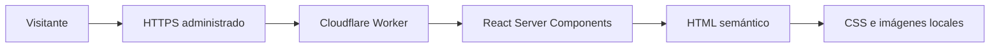

# Arquitectura

## Objetivo

DavesDevs es una landing pública orientada a contenido. Su arquitectura prioriza carga rápida, mantenimiento sencillo, una superficie de ataque pequeña y una salida compatible con infraestructura Cloudflare Workers.

## Decisiones principales

### Renderizado

La interfaz utiliza React Server Components mediante Vinext. La landing no mantiene estado de aplicación y no necesita hidratar componentes propios en el navegador. Los elementos interactivos son enlaces y controles HTML nativos como `details` y `summary`.

### Estilos

El sistema visual vive en `app/globals.css`. Los colores, fuentes y medidas compartidas se definen como variables CSS. Tailwind CSS procesa la hoja y aporta utilidades base; los componentes visuales específicos se expresan con clases del producto.

### Datos

No existe base de datos, almacenamiento, sesión ni API. El contenido se versiona junto al código. Esta decisión es intencional para la versión de lanzamiento y debe revisarse si se añade un CMS, formulario o área privada.

### Recursos

Los iconos y la tarjeta social se sirven desde `public/`. Los recursos importantes incluyen dimensiones explícitas para reservar espacio y reducir cambios de layout.

### Rutas

| Ruta             | Responsabilidad                                                              |
| ---------------- | ---------------------------------------------------------------------------- |
| `/`              | Propuesta comercial, portafolio, servicios, proceso, calidad, FAQ y contacto |
| `/privacidad`    | Tratamiento de información en la versión actual                              |
| `/accesibilidad` | Objetivos, medidas y limitaciones de accesibilidad                           |
| Cualquier otra   | Página 404 propia y no indexable                                             |

## Flujo de una solicitud

No hay llamadas desde el navegador a servicios externos. Los enlaces hacia GitHub y el portafolio técnico requieren una acción explícita del visitante.

## Metadata y descubrimiento

`app/layout.tsx` centraliza título, descripción, canonical, Open Graph, Twitter Card, iconos y datos estructurados. `app/robots.ts`, `app/sitemap.ts` y `app/manifest.ts` generan endpoints compatibles con el App Router.

El origen público se define con `NEXT_PUBLIC_SITE_URL`. La compilación de producción debe recibir la URL final para evitar canonical o sitemap apuntando a un origen local.

## Límites de la arquitectura

Agregar cualquiera de las siguientes capacidades cambia el modelo de riesgo y exige una revisión técnica:

- Formularios o recepción de archivos.
- Analítica, píxeles o cookies.
- CMS o contenido externo.
- Autenticación y cuentas.
- Pagos o reservas.
- Datos personales persistentes.
- Scripts, fuentes o imágenes de terceros.

## Criterio de dependencia

Solo se conserva una dependencia cuando el código entregado la usa. El scaffold inicial se redujo a React, Vinext y Lucide en producción; herramientas de build y calidad permanecen en desarrollo. El lockfile usa versiones exactas para que CI y los entornos locales instalen el mismo árbol.

Vinext sigue una versión anterior a 1.0 y se utiliza por compatibilidad con Sites. Cada actualización debe pasar una instalación limpia, el conjunto completo de validaciones, pruebas HTTP de rutas y metadata y una publicación privada antes de promoverse; no se aceptan fusiones automáticas de esta dependencia.
